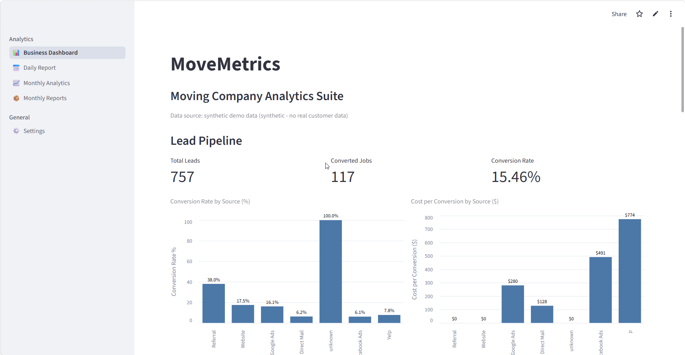

# MoveMetrics — Moving Company Analytics Suite

A lead-to-revenue analytics dashboard built for moving/relocation companies:
tracks the full funnel from lead source, through conversion, to profit —
so you know exactly which marketing channels are actually making money,
not just generating volume.

**[Live demo →](https://andrei0182-pfm-analytics-suite-app-uc0g8b.streamlit.app/)**



> Runs entirely on a bundled **synthetic** dataset — no real customer data,
> no setup required. Clone it and it just works.

## The problem this solves

Most small service businesses can see *how many* leads they're getting from
each channel, but not whether those leads are actually profitable once you
account for lead cost, conversion rate, and average job value. A source with
a low cost-per-lead can easily be a net loss if its conversion rate is bad
enough — and that's invisible in a simple leads-count report.

This dashboard makes that visible at a glance.

## What it shows

- **Lead Pipeline** — total leads, converted jobs, overall conversion rate
- **Conversion Rate by Source** and **Cost per Conversion by Source** — which
  channels convert well, and what a converted job actually costs to acquire
- **Financial overview** — total revenue, average job value, refunds, open
  (uncollected) pipeline
- **Profit by Source** — colored green/red, so a loss-making channel is
  immediately obvious, not buried in a table
- **Source Performance** and **Conversion by Source** — full detail tables,
  sorted from most to least profitable

## Architecture

```
Excel / Google Sheets
        |
        v
     Loaders
        |
        v
Data Cleaning (processing)
        |
        v
 Business Rules (rules)
        |
        v
 Financial Analysis
        |
        v
       KPIs
        |
        v
    Dashboard
```

- **One place reads the source data** (`src/loaders/`) — a local Excel file
  or a live Google Sheet, interchangeably.
- **One place cleans it** (`src/processing/`) — deduplicates multi-row leads
  into one row per job, handles both US and European number formats
  (`"$1,050.00"` vs `"1050,00"`), tolerates missing columns.
- **One place applies business rules** (`src/rules/`) — e.g. flags rows
  where a data-entry error shifted a Job ID into the Source column.
- **Analysis modules** (`src/analysis/`, `src/models/`) never touch raw
  data — they only receive already-clean, already-validated data.
- **`src/pipeline.py`** is the single orchestrator; **`src/ui/dashboard.py`**
  only renders what the pipeline hands it — no business logic in the UI
  layer.

This separation means swapping the data source, adding a new business rule,
or adding a new chart never requires touching more than one file.

## Running it locally

```bash
pip install -r requirements.txt
streamlit run app.py
```

That's it — it loads the bundled synthetic dataset (`data/demo/sample_leads.xlsx`)
automatically.

## Using your own data

1. Set `USE_OWN_DATA = True` in `config/settings.py`
2. Drop your report at `data/raw/report_current.xlsx`, with a sheet named
   `LEADS` (or update `LEADS_SHEET_NAME` in settings) containing at least:
   `Job #`, `Source`, `Date`, `Status`, `Charged`, `Cost`, `Deposit`

Or point it at a live Google Sheet instead: set `GOOGLE_SHEET_ID` in
`config/settings.py` (the sheet must be shared as "Anyone with the link -
Viewer").

## Tests

```bash
pytest tests/ -v
```

48 tests covering the money parser (both locale formats), deduplication
logic, business rules, KPI calculations, and the full pipeline end to end.

## Tech stack

Python · pandas · Streamlit · Altair · pytest
